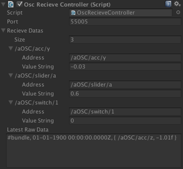

# Unity-OscReceiveController
Wrapper script of Rug.OSC library for unity.

# Require
Rug.OSC
https://bitbucket.org/rugcode/rug.osc

# Usage
Enter the OSC address that you want to get the value in UnityEditor inspector.
